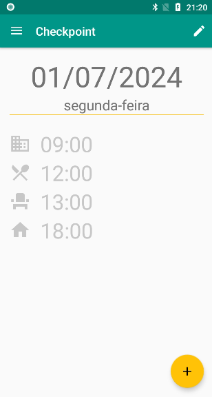
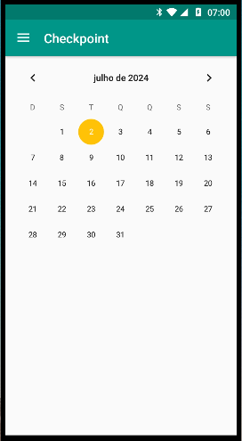
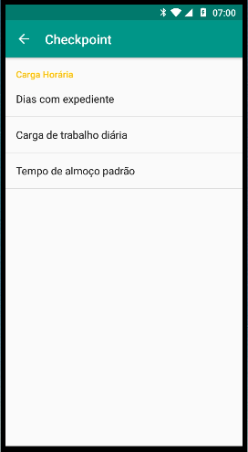

# Check Point App 
O aplicativo é sobre a marcação de ponto pelo funcionário, como um histórico e lembrete de horário para evitar marcações fora do horário.  

#### Telas
| CheckpointTodayFragment  | CalendarFragment| SettingsActivity | 
| ------------- | ------------- | ----- | 
|  |  |  |

## Finalidade
- [x] **Estudo**: Este projeto foi criado para fins de aprendizado e prática.
- [ ] **Curso**: Este projeto é parte de um curso específico.
- [ ] **Projeto Real**: Este projeto é uma aplicação real a ser publicado.

Com o estudo o foco é criar um padrão de fácil alteração da origem de dados. A construção do `DataSourceFactory` e implementações de várias fontes de dados possibilitaria uma troca de forma fácil entre os vários Data Sources. 
Além da organização de layout, timers e calendários.

## Outras Considerações
- **Construção paralizada:** Emeados de 2016;

### Badges

